```{r setup, include=FALSE}
options(htmltools.dir.version = FALSE)
knitr::opts_chunk$set(tidy=TRUE, tidy.opts=list(width.cutoff=50), fig.height= 4, fig.width=4, dev='svg', fig.align="center", fig.path = "fig/")
```

```{r xaringan-themer, include=FALSE}
library(xaringanthemer)
style_duo(primary_color = "#1F4257", secondary_color = "#F97B64", table_row_even_background_color = "#1F4257")
```
---
# Material

The content of the course is available at

.center[<https://github.com/sdray/LausanneBasic/>]

In R, you can download the course by

`usethis::use_course("sdray/LausanneBasic", destdir = "~/Bureau/")`

---
# Required packages

* `ade4` to run the analyses

* `adegraphics` to represent results

* `rgl` to understand multivariate methods in interactive 3D

---
# **ade4**

*  R package since 2002
*  Exploratory analysis of ecological data
  - Multivariate methods
  - Graphical functions

```{r, out.width="80%", echo = FALSE}
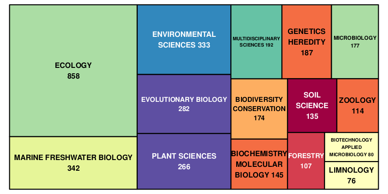
```
---
# Data structure

.pull-left[
```{r, echo = FALSE}
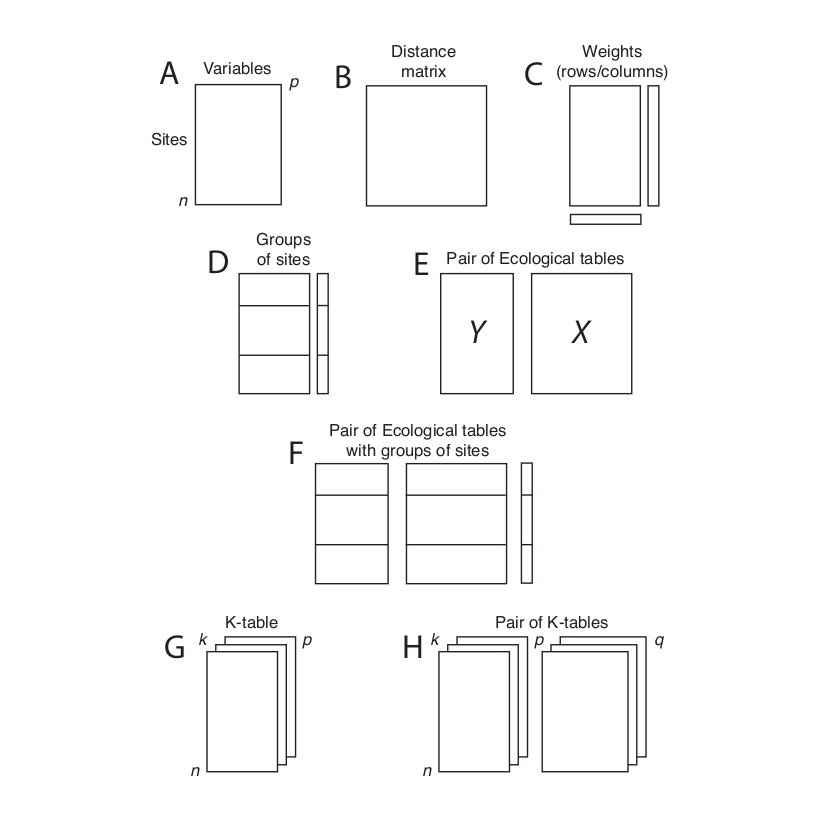
```
]

.pull-right[
```{r, echo = FALSE}
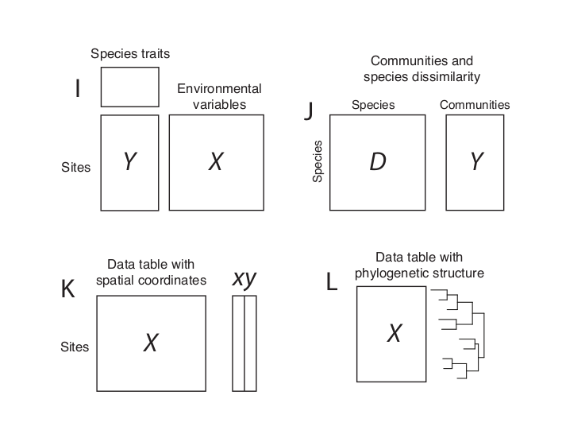
```
]
---
# Data structure

.pull-left[
```{r, echo = FALSE}
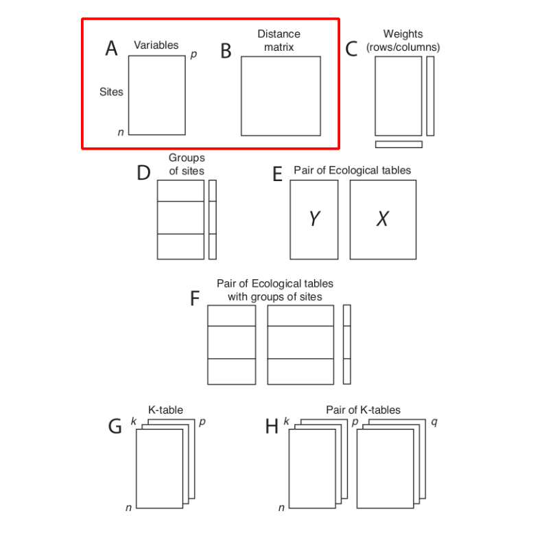
```
]

.pull-right[
```{r, echo = FALSE}

```
]
---
# Module 1: course outline
We will explore the geometric properties, outputs and interpretation of multivariate analysis focusing on one-table methods. Last afternoon for case studies.

.left-column[
```{r, echo = FALSE}
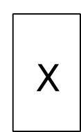
```
]

.right-column[
* Environmental variables 
  - Quantitative variables
      &rarr; Principal Component Analysis (`dudi.pca`)
  - Categorical variables
    &rarr; Multiple Correspondence Analysis (`dudi.acm`)
  - Mix of both
&rarr; Hill-Smith Analysis (`dudi.hillsmith`)

* Species table
  - Contingency table
      &rarr; Correspondence Analysis (`dudi.coa`)
  - Distance matrix
      &rarr; Principal Coordinates Analysis (`dudi.pco`)
]


---

# **ade4**: the French way

.pull-left[
```{r, echo = FALSE}
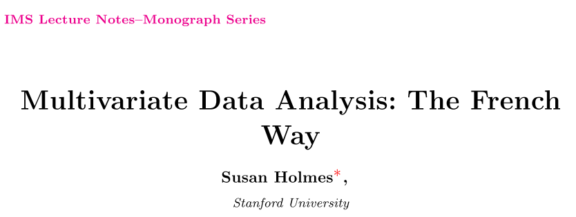
```
]

.pull-right[
```{r, echo = FALSE}
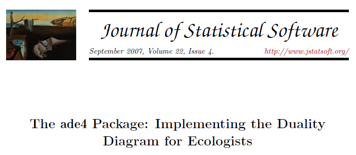
```
]

Implementation of functions in `ade4` follows the duality diagram theory

More details are provided in the paper published in Journal of Statistical Software available [here](https://www.jstatsoft.org/article/view/v022i04)
---
# Two geometric views

```{r, echo = FALSE}
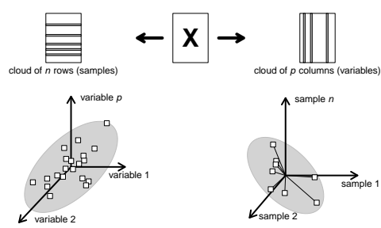
```
.pull-left[
what are the main similarities and differences between the individuals ?
]

.pull-right[
what are the main relationships between the variables ?
]
---
# Explore the space of individuals

.center[

[Go to practical 1](../../practical/session1/session1.html)

]
---
# Geometric view for individuals
```{r, echo = FALSE}
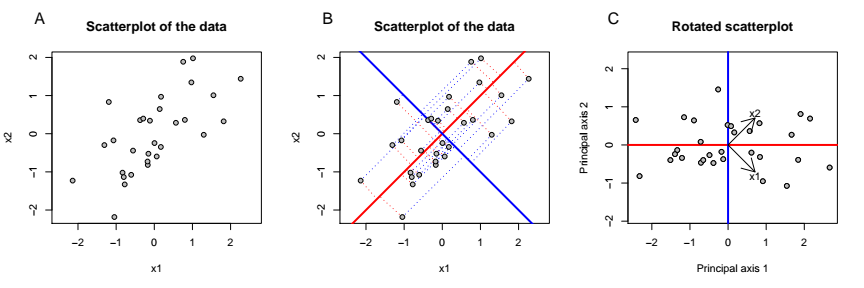
```

* Multivariate methods only perform geometric operations (rotations) to obtain the best viewpoint on the data

* When many variables are considered, dimension reduction is also applied to simplify the interpretation
---
# Statistical triplet

  Multivariate methods aim to answer these two questions and seek for small dimension hyperspaces (few axes) where the representations of individuals and variables are as close as possible to the original ones.


To answer the two previous questions, we define

* $\mb{Q}$, a $p \times p$ positive symmetric matrix, used as an inner product in $\mathbb{R}^p$ and thus allows to measure distances between the $n$ individuals
* $\mb{D}$,  a $n \times n$ positive symmetric matrix, used as an inner product in $\mathbb{R}^n$ and thus allows to measure relationships between the $p$ variables.

$$ \left ( \mathbf{X}, \mathbf{Q}, \mathbf{D} \right ) $$
---
# Duality diagram theory
$$\mathbf{X} \mathbf{Q} \mathbf{X}\tr \mathbf{D} \mathbf{K} = \mathbf{B} \bm{\Lambda}$$
    $$\mathbf{X}\tr\mathbf{D}\mathbf{X} \mathbf{Q} \mathbf{A} =  \mathbf{A} \bm{\Lambda}$$

  
* $\mathbf{B}$ contains the principal components ( $\mathbf{B}\tr\mathbf{D}\mathbf{B}=\mathbf{I}_r$ ).
* $\mathbf{A}$ contains the principal axis ( $\mathbf{A}\tr\mathbf{Q}\mathbf{A}=\mathbf{I}_r$ ).

* $\mb{L}=\mb{X}\mb{Q}\mb{A}$ contains the row scores (projection of the rows of $\mb{X}$ onto the principal axes)
* $\mb{C}=\mb{X}\tr\mb{D}\mb{B}$ contains the column scores (projection of the columns of $\mb{X}$ onto the principal components)
 
   Maximization of:
   
   $Q(\mathbf{a})=\mathbf{a}\tr\mathbf{Q}\tr\mathbf{X}\tr \mathbf{DXQa} = \lambda$ and  $S(\mathbf{b})=\mathbf{b}\tr\mathbf{D}\tr\mathbf{XQX}\tr\mathbf{Db}=\lambda$
   
   $$\left\langle {\mathbf{XQa}} | \mathbf{k} \right\rangle _\mathbf{D}=\left\langle {\mathbf{X}^t\mathbf{Db}} | \mathbf{a} \right\rangle _\mathbf{Q} = \sqrt{\lambda}$$
---
# Implementation in `ade4`
Computations are performed by the function `as.dudi`. This functions takes 3 arguments defining the statistical triplet and returns an object of class `dudi` that contains:

| `ade4`  | theory | Definition|
|-----------------------------------|----------------------------------------------|---|
| `tab`                      | $\mathbf{X}$                                 | (transformed) data table  |
| `cw`                       | $\mathbf{Q}$                                 | inner product for rows    |
| `lw`                       | $\mathbf{D}$                                 | inner product for columns |
|-------|----------|----------------------------------------|
| `eig`                      | $\bm{\Lambda}$                               | eigenvalues               |
| `l1`                       | $\mathbf{B}$                                 | principal components      |
| `c1`                       | $\mathbf{A}$                                 | principal axes            |
| `li`                       | $\mathbf{L}$                                 | row scores                |
| `co`                       | $\mathbf{C}$                                 | column scores             |

---
# From the theory

```{r, echo = FALSE, out.width="30%"}

```

.pull-left[
* The principal axes

$$ \mathbf{X}\tr\mathbf{D}\mathbf{X} \mathbf{Q} \mathbf{A} =  \mathbf{A} \bm{\Lambda} $$

* The row scores

$$\mathbf{L}=\mathbf{X}\mathbf{Q}\mathbf{A}$$

* Maximization of

$$ Q(\mathbf{a})=\mathbf{a}\tr\mathbf{Q}\tr\mathbf{X}\tr \mathbf{DXQa} = \lambda $$

$$ Q(\mathbf{a})=\sqnorm{\mathbf{XQa}}{\mb{D}} = \lambda
$$
]

.pull-right[
* The principal components

$$\mathbf{X} \mathbf{Q} \mathbf{X}\tr \mathbf{D} \mathbf{K} = \mathbf{B} \bm{\Lambda}$$
* The column scores

$$ \mathbf{C}=\mathbf{X}\tr\mathbf{D}\mathbf{B} $$
* Maximization of 

$$ S(\mathbf{b})=\mathbf{b}\tr\mathbf{D}\tr\mathbf{XQX}\tr\mathbf{Db}=\lambda $$

$$ S(\mathbf{b})=\sqnorm{\mathbf{X}\tr\mathbf{Db}}{\mb{Q}} = \lambda
$$

]
---
# To the practice in `ade4`
```{r, echo = FALSE, out.width="30%"}

```

.pull-left[
* The principal axes

.center[
`$c1`
]

* The row scores

.center[
`$li`
]

* Maximization of

.center[
`$eig`
]
]

.pull-right[
* The principal components

.center[
`$l1`
]

* The column scores

.center[
`$co`
]

* Maximization of 

.center[
`$eig`
]

]

---
# Compute a PCA by hand

.center[

[Go to practical 1](../../practical/session1/session1.html#11)

]
---
# Methods for `dudi` objects

* `print`
* `summary`
* `screeplot`
* `scatter` / `biplot`
* `score`
* `is`
* `t`
* `inertia`
* `suprow` / `supcol`
* `reconst`
* `dist.dudi`
---
# User-level functions

* The `as.dudi` function is an internal function

* It is called by user-friendly functions corresponding to different analyses

* It can be used by experimented users to define their own analysis

```{r}
library(ade4)
apropos("dudi.")
```
---
# Available methods

Different definitions of a statistical triplet correspond to different methods

| Function name  | Analysis name                         |
|----------------|---------------------------------------|
| dudi.pca       | Principal component analysis          |
| dudi.pco       | Principal coordinate analysis         |
| dudi.coa       | Correspondence analysis               |
| dudi.acm       | Multiple correspondence analysis      |
| dudi.dec       | Decentered correspondence analysis    |
| dudi.fca       | Fuzzy correspondence analysis         |
| dudi.fpca      | Fuzzy PCA                             |
| dudi.mix       | Mixed nalysis                   |
| dudi.hillsmith | Hill-Smith analysis |
| dudi.nsc       | Non-symmetric correspondence analysis |

---
# Graphical functions

* Outputs of multivariate methods are usually provided as plots
* `ade4` contains several graphical functions
* they have been re-implemented in a much more flexible way in the package `adegraphics`

A comprehensive overview of the package is available in its vignette available [online](https://cran.r-project.org/web/packages/adegraphics/vignettes/adegraphics.html) or in R by:

```{r, eval = FALSE}
vignette("adegraphics")
```

See also the paper published in the R Journal  [here](https://journal.r-project.org/archive/2017/RJ-2017-042/index.html)
---
# The ade packages

* `adegraphics`: S4-lattice based multivariate graphics
* `adespatial`: spatial multiscale multivariate analysis
* `adiv`: analysis of diversity
* `adehabitat`: analysis of habitat selection by animals
* `adegenet`: classes and methods for the multivariate analysis of
genetic markers
* `adephylo`: exploratory analyses for the phylogenetic comparative
method
* `ade4TkGUI`: graphical interface 
---
# ade4TkGUI

```{r, echo = FALSE, out.width="80%"}
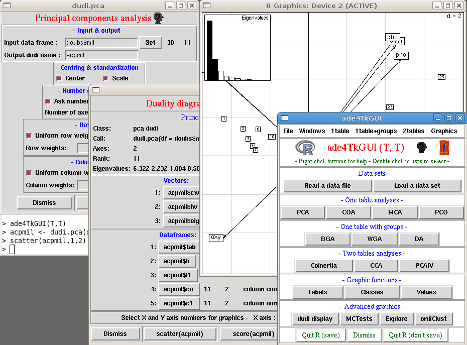
```
---
# Resources
.pull-left[
```{r, echo = FALSE}
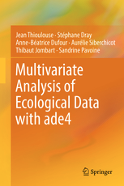
```

https://www.springer.com/fr/book/9781493988488
]

.pull-right[
* Mailing list:

	http://listes.univ-lyon1.fr/wws/info/adelist


* Development:

	https://github.com/sdray/ade4


* Courses (in French): 

	http://pbil.univ-lyon1.fr/R/enseignement.html
]
