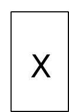
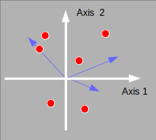

```{r setup, include=FALSE}
options(htmltools.dir.version = FALSE)
knitr::opts_chunk$set(tidy=TRUE, tidy.opts=list(width.cutoff=50), fig.height= 4, fig.width=4, dev='svg', fig.align="center", fig.path = "fig/")
```

```{r xaringan-themer, include=FALSE}
library(xaringanthemer)
style_duo(primary_color = "#1F4257", secondary_color = "#F97B64", table_row_even_background_color = "#1F4257")
```
---
# Data structure

.left-column[
```{r, echo = FALSE}

```
]

.right-column[
* One table with *p* variables measured on *n* individuals

* All variables are **quantitative**

* For instance
    - sites $\times$ environmental variables
    - species $\times$ traits
    - individuals $\times$ alleles
    - populations $\times$ alleles
]
---
# Objectives

* Identify what is the main information contained in the table

  - Identify which variables are the most linked
  - Identify the principal differences/similarities between individuals
---
# Data

We consider the `meaudret` data set

```{r}
library(ade4)
data(meaudret)
names(meaudret)
dim(meaudret$env)
names(meaudret$env)
```
---
The data set contains an environmental table with 20 measurements of 9 environmental variables. The measurements have been made in 5 sites at each season along a small French stream (see `?meaudret`)

```{r}
head(meaudret$design)
```

We want to know

* what are the main environmental gradients, i.e., which variables co-vary (if any)
* which samples have similar/different environmental conditions 
---
# Principal component analysis

* $\mathbf{X}$ contains centred or scaled variables

* $\mathbf{Q} = \mathbf{I}_p$ is the identity matrix (diagonal matrix with 1s)

* $\mathbf{D} = \frac{1}{n}\mathbf{I}_n$ is the diagonal matrix with $\frac{1}{n}$


.column-left[
```{r, echo = FALSE}

```
]

.column-center[

.center[
`dudi.pca`

```{r, echo = FALSE}
knitr::include_graphics("img/arrow.png")
```
]
]

.column-right[
```{r, echo = FALSE}

```
]

---
# Maximized criteria

* For individuals

$$ Q(\mathbf{a})=\sqnorm{\mathbf{XQa}}{\mb{D}} = \sqnorm{\mathbf{Xa}}{\frac{1}{n}\mb{I}_n} = var(\mathbf{Xa})= \lambda
$$

* For variables

  - Centred data ( $x_{ij} - \bar{x}_j$ )
$$S(\mathbf{b})=\sqnorm{\mathbf{X}\tr\mathbf{Db}}{\mb{Q}} =\sqnorm{\frac{1}{n}\mathbf{X}\tr\mathbf{b}}{\mb{I}_p} = \sum_{j=1}^p{cov^2(\mathbf{x}_j, \mathbf{b})} = \lambda$$

  - Scaled data  ( $(x_{ij} - \bar{x}_j) / s_j$  )
$$S(\mathbf{b})=\sqnorm{\mathbf{X}\tr\mathbf{Db}}{\mb{Q}} =\sqnorm{\frac{1}{n}\mathbf{X}\tr\mathbf{b}}{\mb{I}_p} = \sum_{j=1}^p{cor^2(\mathbf{x}_j, \mathbf{b})} = \lambda$$

---
# The `dudi.pca` function
## Arguments

```{r}
args(dudi.pca)
```
* `df` is a `data.frame` with the data
* `row.w` and `col.w` are optional vectors of weights
* `center` and `scale` define the standardization of the data
* `scannf` and `nf` allow to set the number of dimensions to interpret

```{r}
pca.meau <- dudi.pca(meaudret$env, scannf = FALSE)
```
---
## Returned values

```{r}
names(pca.meau)
```
It returns an object of class `dudi` containing:

- `$eig`: eigenvalues ( $\mb{\Lambda}$ )
- `$cw`: column weights ( $\mb{Q}=\mb{I}_p$ )
- `$lw`: row weights ( $\mb{D}=\frac{1}{n}\mb{I}_n$ )
- `$tab`: transformed data table ( $\mb{X}$ )
- `$c1`: principal axes or variable loadings ( $\mb{A}$ )
- `$li`: row scores ( $\mb{L}=\mathbf{XA}$ )
- `$l1`: principal components ( $\mb{B}$ )
- `$co`: column scores ( $\mb{C}=\frac{1}{n}\mb{X}\tr\mb{B}$ )
---
# Graphical representation and interpretation

As we have *two* analyses (individuals and variables spaces), two representations can be defined:
* **distance biplot** where $\mb{A}$ and $\mb{L}=\mathbf{XA}$ (`$c1`, `$li`) are superimposed.
* **correlation biplot** where $\mb{B}$ and $\mb{C}=\frac{1}{n}\mb{X}\tr\mb{B}$ (`$l1`, `$co`) are superimposed.

In the first interpretation, PCA finds coefficients for variables (`$c1`) to compute a linear combination (`$li`) that provides an ordination of individuals with the greatest dispersion (maximum variance). 

In the second interpretation, PCA provides a linear combination (`$l1`) that maximise the correlations (`$co`) with all variables (or covariances for centred PCA). Hence, it is the best summary of the variables.
---
## The `biplot` function

```{r, message=FALSE}
library(adegraphics)
```

.pull-left[
```{r}
biplot(pca.meau)
```
]

.pull-right[
```{r}
biplot(pca.meau, permute = TRUE)
```
]
---
## Separate representations

.pull-left[
```{r}
s.label(pca.meau$li)
```
]
.pull-right[
```{r}
s.arrow(pca.meau$co)
```
]
---
## Separate representations

.pull-left[
```{r}
s.label(pca.meau$li)
```
]
.pull-right[
```{r}
s.corcircle(pca.meau$co)
```
]
---
## Separate representations

.pull-left[
```{r}
s.class(pca.meau$li, meaudret$design[,1], col = TRUE)
```
]
.pull-right[
```{r}
s.arrow(pca.meau$co)
```
]
---
# To scale or not to scale


Scaling should be performed when we do not want that differences in variances affect the results

```{r}
pca.meau.c <- dudi.pca(meaudret$env, scannf = FALSE, scale = FALSE)
```

.pull-left[
```{r, out.width="70%", echo=FALSE}
biplot(pca.meau, row.main = "scale = TRUE")
```
]

.pull-right[
```{r, out.width="70%", echo=FALSE}
biplot(pca.meau.c, row.main = "scale = FALSE")
```

]

In our case, we must scale the data as differences in variances are mainly due to differences in units
---
# Inertia statistics

```{r}
summary(pca.meau)
```
---
# PCA in practice

.center[

[Go to practical 2](../../practical/session2/session2.html)

]

