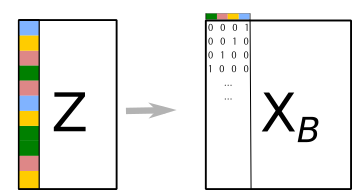

```{r setup, include=FALSE}
options(htmltools.dir.version = FALSE)
knitr::opts_chunk$set(tidy=TRUE, tidy.opts=list(width.cutoff=50), fig.height= 4, fig.width=4, dev='svg', fig.align="center", fig.path = "fig/")
```

```{r xaringan-themer, include=FALSE}
library(xaringanthemer)
style_duo(primary_color = "#1F4257", secondary_color = "#F97B64", table_row_even_background_color = "#1F4257")
```
---
# Data structure

.left-column[
```{r, echo = FALSE}

```
]

.right-column[
* One table with *p* variables measured on *n* individuals

* All variables are **qualitative** (categorical)

* For instance
    - sites $\times$ environmental variables (e.g., soil types)
    - species $\times$ traits (e.g., functional groups)
]
---
# Objectives

* Identify what is the main information contained in the table

  - Identify which *categories* are the most linked
  - Identify the principal differences/similarities between individuals
---
# Data

We consider the `meaudret` data set

```{r}
library(ade4)
data(meaudret)
names(meaudret)
dim(meaudret$env)
names(meaudret$env)
```
---
# Categorical variables

The data set contains an environmental table with 20 measurements of 9 environmental variables. For this example, quantitative variables are transformed into categorical variables:

```{r}
env.categ <- apply(meaudret$env, 2, cut, breaks = 3, labels = c("low", "med", "hi"))
env.categ <- as.data.frame(env.categ, stringsAsFactors = TRUE)
head(env.categ, 3)
```

We want to know

* what are the main environmental gradients, i.e., which variables co-vary (if any)
* which samples have similar/different environmental conditions 
---
# Quantitative and categorical variables

* Some variables are recorded as categorical
* Quantitative variables can always be recoded as categorical ones
  - `r emo::ji("sad_but_relieved_face")` This introduces a loss of information (different values are regrouped into a single category)
  - `r emo::ji("smile")` It allows to detect non-linear relationships (order of categories is lost)
  
```{r, out.width="40%", fig.dim = c(6,4)}
plot(meaudret$env[, 1] ~ env.categ[, 1], ylab = "Quantitative Temp",
xlab = "Qualitative Temp")
```

---
# Disjunctive table

The original data table $\mathbf{Z}$ contains categorical information (words).

The first step is to build a disjunctive table with numbers. Information is stored as a binary table with $n$ rows and $m$ columns (total number of categories).

```{r, echo = FALSE}

```

---
# Multiple correspondence analysis

* $\mathbf{X}=\mb{X}_B{\mb{D}_m}^{-1}-{\mb{1}_{n}}{\mb{1}_{m}}\tr$ is the the transformed and centred disjunctive table

* $\mathbf{Q} = \frac{1}{p}\mb{D}_m$ where $\mb{D}_m=diag(\mb{X}_B\tr\mb{D}\mb{1}_{n})$ contains the category frequencies

* $\mathbf{D} = \frac{1}{n}\mathbf{I}_n$ is the diagonal matrix with $\frac{1}{n}$

.column-left[
```{r, echo = FALSE}

```
]

.column-center[

.center[
`dudi.acm`

```{r, echo = FALSE}
knitr::include_graphics("img/arrow.png")
```
]
]

.column-right[
```{r, echo = FALSE}
knitr::include_graphics("img/pca-map.png")
```
]

---
# Maximized criteria

* For individuals

$$ Q(\mathbf{a})=\sqnorm{\mathbf{XQa}}{\mb{D}} = \sqnorm{\mathbf{X}\frac{1}{p}\mathbf{D}_m\mb{a}}{\frac{1}{n}\mb{I}_n}=\sqnorm{\frac{1}{p}\mathbf{X}_B\mb{a}}{\frac{1}{n}\mb{I}_n}=var\left (\frac{1}{p}\mb{X}_B\mb{a} \right ) =   \lambda
$$

* For variables


 $$\sqnorm{\mb{X}\tr\mb{Db}}{\mb{Q}} = \sqnorm{\mathbf{X}\tr\frac{1}{n}\mb{I}_n\mb{b}}{\frac{1}{p}\mb{D}_m}=\sqnorm{\frac{1}{n}\mb{D}_m^{-1}\mathbf{X}_B\tr\mb{b}}{\frac{1}{v}\mb{D}_m}$$ 

The vector $\frac{1}{n}\mb{D}_m^{-1}\mathbf{X}_B\tr\mb{b}$ contains means of $\mb{b}$ per category so that:

 $$\sqnorm{\mathbf{X}\tr\frac{1}{n}\mb{I}_n\mb{b}}{\frac{1}{p}\mb{D}_m}=\frac{1}{p}\sum_{j=1}^{p}\eta^2(\mathbf{z}_j,\mathbf{b})$$ 

This quantity is the mean of correlation ratios computed for all variables.

---
# The `dudi.acm` function
## Arguments

```{r}
args(dudi.acm)
```
* `df` is a `data.frame` with the categorical data (`factors` in R)
* `row.w` is an optional vector of weights
* `scannf` and `nf` allow to set the number of dimensions to interpret

```{r}
mca.meau <- dudi.acm(env.categ, scannf = FALSE)
```
---
## Returned values

```{r}
names(mca.meau)
```
It returns an object of class `dudi` containing:

- `$eig`: eigenvalues ( $\mb{\Lambda}$ )
- `$cw`: column (i.e., category) weights ( $\frac{1}{v}\mb{D}_m$ )
- `$lw`: row weights ( $\mb{D}=\frac{1}{n}\mb{I}_n$ )
- `$tab`: transformed and centred disjunctive data table ( $\mb{X}$ )
- `$c1`: category loadings ( $\mb{A}$ )
- `$li`: row scores ( $\mb{L}=\frac{1}{p}\mathbf{X}_B\mb{A}$ )
- `$l1`: principal components ( $\mb{B}$ )
- `$co`: column scores ( $\mb{C}=\frac{1}{n}\mb{D}_m^{-1}\mathbf{X}_B\tr\mb{B}$ )
- `$cr`: correlation ratios between qualitative variables and axes
---
# Graphical representation and interpretation


In the first viewpoint, MCA positions categories by a normed score (`$c1`}. A score for individuals (`$li`) is derived from this categories score: an individual is located at the mean of the score of the categories that it carries.
This second score provides an ordination of individuals with the highest possible dispersion (maximum variance).

In the second type of interpretation, MCA finds normed coordinates for individuals (`$l1`) and positions categories at the mean of the individual scores that belong to them (`$co`). This maximises the mean of the variance of the categories for all variables. In other words, it maximises the mean of the correlation ratios.

---
## Graphical representations

.pull-left[
```{r}
s.label(mca.meau$co)
```
]
.pull-right[
```{r}
s.label(mca.meau$li)
```
]

---
## Optimal representation

.pull-left[
```{r}
plot(mca.meau, col = TRUE)
```
]

.pull-right[
```{r}
mca.meau$cr
```
]
---
# Inertia statistics

```{r}
summary(mca.meau)
```
---
# Mix of variables

If a table contains both quantitative and categorical variables, Hill and Smith analysis (HSA) can be applied.

This method is a compromise between PCA and MCA. 

* If all the variables are quantitative, then the results of HSA are identical to those of PCA.
* If all the variables are qualitative, then the results are identical to those of MCA. 
* If there is a mix of variables, then the analysis is an optimal combination of the properties of the two analyses (maximizing the squared correlations for quantitative variables and correlation ratios for categorical ones)
---

# MCA in practice

.center[

[Go to practical 3](../../practical/session3/session3.html)

]
