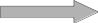
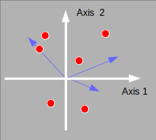

```{r setup, include=FALSE}
options(htmltools.dir.version = FALSE)
knitr::opts_chunk$set(tidy=TRUE, tidy.opts=list(width.cutoff=50), fig.height= 4, fig.width=4, dev='svg', fig.align="center", fig.path = "fig/")
```

```{r xaringan-themer, include=FALSE}
library(xaringanthemer)
style_duo(primary_color = "#1F4257", secondary_color = "#F97B64", table_row_even_background_color = "#1F4257")
```
---
# Data structure

.left-column[
```{r, echo = FALSE}

```
]

.right-column[
* One table with *n* rows and *m* columns

* Data are counts of individuals (sums by row and columns are meaningful) 

* For instance
    - sites $\times$ species 
]
---
# Objectives

* Identify what is the main information contained in the table

  - Identify the principal differences/similarities between row categories
  - Identify the principal differences/similarities between column categories
  - Identify the principal differences/similarities between row and column categories
  
---
# Data

We consider the `meaudret` data set

```{r}
library(ade4)
data(meaudret)
names(meaudret)
dim(meaudret$spe)
head(meaudret$spe.names)
```
---
The data set contains the abundances of 13 Ephemeroptera species in 20 samples. The measurements have been made in 6 sites at each season along a small French stream (see `?meaudret`)

```{r}
head(meaudret$design)
```

We want to know

* which species have similar distributions
* which sites have similar composition
* which species are mainly present in which sites
---
# Contingency table

.pull-left[
```{r}
library(adegraphics)
table.value(meaudret$spe, symbol = "circle", ppoints.cex = 0.5)
```
]

.pull-right[
```{r}
head(rowSums(meaudret$spe))
head(colSums(meaudret$spe))
sum(meaudret$spe)
```

]
---
# Chi-square test

The $\chi^2$ test allows to measure and evaluate the significance of the association between species and sites (the null hypothesis is the random distribution)

$$\chi^2_{obs} = \sum_{i=1}^I \sum_{j=1}^J \frac{\left( y_{ij} - \frac{y_{i.} \, y_{.j}}{y_{..}} \right)^2}{\frac{y_{i.} \, y_{.j}}{y_{..}}}$$

```{r}
chisq.test(meaudret$spe)
```
---
# Absolute and relative frequencies
```{r, echo=FALSE, fig.dim=c(5,2.5)}
fgauss <- function(x = 1:20, mu, t, h) h * exp(-(x - mu)^2/(2 * t^2))
sp1 <- fgauss(mu = 10, t = 5, h = 35)
sp2 <- fgauss(mu = 10, t = 5, h = 10)
sp3 <- fgauss(mu = 13, t = 5, h = 10)
sim <- round(cbind(sp1, sp2, sp3))

dpca <- dist.dudi(dudi.pca(sim, scale = FALSE, scannf = FALSE), amongrow = FALSE)
dcoa <- dist.dudi(dudi.coa(sim, scannf = FALSE), amongrow = FALSE)

g1 <- s1d.curves(sim, p1d.hori = FALSE, paxes.draw = TRUE, plines.col = 1:3, ppoints.col = 1:3, xlab = "sites", ylab = "abundance",
    key = list(space = "inside", text = list(lab = colnames(sim), col = 1:3)), plot = FALSE)
g2 <- table.image(dpca, axis.text = list(col = 1:3), xlab = "PCA", plot = FALSE)
g3 <- table.image(dcoa, axis.text = list(col = 1:3), xlab = "CA", plot = FALSE)
ADEgS(list(g1, g2, g3), layout = matrix(c(rep(1, 4), 2, 3), 2))
```

* In PCA (Euclidean distances), species 2 and 3 are closer
* In COA ( $\chi^2$ distances), species 1 and 2 are closer (null distance)
---
# Correspondence analysis 

* $\mathbf{X}=\mathbf{D}_n^{-1}\mb{P}\mathbf{D}_m^{-1} - \mb{1}_n\mb{1}_m\tr$ is the  transformed and centred table of relative frequencies with $\mb{P}=[y_{ij}/y_{..}]$

* $\mathbf{Q} = \mb{D}_m$ where $\mb{D}_m=diag(\mb{P}\tr\mb{1}_n)$ contains the column category frequencies

* $\mathbf{D} = \mb{D}_n$ where $\mb{D}_n=diag(\mb{P1}_m)$ contains the row category frequencies

.column-left[
```{r, echo = FALSE}

```
]

.column-center[

.center[
`dudi.coa`

```{r, echo = FALSE}

```
]
]

.column-right[
```{r, echo = FALSE}

```
]

---
# Maximized criteria

* For rows

$$Q(\mathbf{a})=\sqnorm{\mathbf{D}_n^{-1}\mb{P}_0\mathbf{D}_m^{-1}\mathbf{D}_m\mb{a}}{\mb{D}_n}=\sqnorm{\mathbf{D}_n^{-1}\mb{P}_0\mb{a}}{\mb{D}_n}$$

In this viewpoint, columns have a unit-variance score $\mb{a}$ that maximises the variance between the row barycenters.

* For columns

 $$\sqnorm{\mathbf{D}_m^{-1}\mb{P}_0\tr\mathbf{D}_n^{-1}\mathbf{D}_n\mb{b}}{\mb{D}_m}=\sqnorm{\mathbf{D}_m^{-1}\mb{P}_0\tr\mb{b}}{\mb{D}_m}$$ 
In this viewpoint, rows have a unit-variance score $\mb{b}$ that maximises the variance between the column barycenters.

---
# The `dudi.coa` function
## Arguments

```{r}
args(dudi.coa)
```
* `df` is a `data.frame` with the positive values (counts)
* `scannf` and `nf` allow to set the number of dimensions to interpret

```{r}
coa.meau <- dudi.coa(meaudret$spe, scannf = FALSE)
```
---
## Returned values

```{r}
names(coa.meau)
```
It returns an object of class `dudi` containing:


- `$eig`: eigenvalues ( $\mb{\Lambda}$ ) 
- `$cw`: column weights ( $\mb{D}_m$ )
- `$lw`: row weights ( $\mb{D}_n$ )
- `$tab`: centred relative frequencies table ( $\mb{D}_n^{-1}\mb{P}_0\mb{D}_m^{-1}$ )
- `$c1`: unit-variance column scores ( $\mb{A}$ )
- `$li`: row scores  as weighted averages ( $\mb{L}=\mathbf{D}_n^{-1}\mb{P}_0\mb{A}$ )
- `$l1`: unit-variance row scores ( $\mb{B}$ )
- `$co`: column scores as weighted averages ( $\mb{C}=\mathbf{D}_m^{-1}\mb{P}_0\tr\mb{B}$ )
- `$N`: total sum ( $y_{..}$ )
---
# Graphical representations

Biplot can be produced for CA using the `biplot` function. Three types of biplots can be produced using the argument `method`
* If `method = 2`, species are positioned by a unit-variance score (`$c1`) and sites by weighted averaging (`li`).
* If `method = 3`, sites are positioned by a unit-variance score (`$l1`) and species by weighted averaging (`$co`).
* By default, `method = 1` corresponds to a compromise between these two representations (`$li` and `$co`).  
---
# Weighted averaging


.pull-left[
```{r, echo = FALSE}
scatter(coa.meau, method = 3, posieig = "none")
```
]

.pull-right[
```{r, echo = FALSE}
sv1 <- s.value(coa.meau$l1, meaudret$spe[, 1], col = 1:2, plegend.drawKey = FALSE, symbol = "circle", centerpar = TRUE, plot = FALSE)
sd1 <- s.distri(coa.meau$l1, meaudret$spe[, 1, drop = FALSE], col = 'red', ellipseSize = 0, ppoints.cex = 0, plot = FALSE)
sv1+sd1
```
]

---
# Separate representations

.pull-left[
```{r}
s.label(coa.meau$co, plabels.optim = TRUE, ppoints.cex = 0.5)
```


]
.pull-right[
```{r}
s.label(coa.meau$li, plabels.optim = TRUE, ppoints.cex = 0.5)
```
]
---
# Reordering of a table

```{r, fig.dim=c(6,3)}
g1 <- table.value(meaudret$spe, ppoint.cex = 0.5, symbol = "circle", plot = FALSE)
g2 <- table.value(meaudret$spe, ppoint.cex = 0.5, symbol = "circle", coordsx = rank(coa.meau$co[,1]), coordsy = rank(coa.meau$li[,1]), plot = FALSE)
cbindADEg(g1, g2, plot = TRUE)
```

---
# Principal coordinates analysis

* PCA, CA methods induce implicitly a way to compute distances
* Several other distances have been proposed (e.g., genetic, presence-absence) 
* PCoA takes a distance matrix as input and returns coordinates in a low dimensional space that best preserve the original distances.


* `r emo::ji("smile")`  it allows to choose a particular distance measure between sites (or species). 
* `r emo::ji("sad_but_relieved_face")`  it focuses either on individuals or variables, not both.

* Useful if distances are directly recorded or computed from raw data tables
---
```{r}
dJ <- dist.binary(meaudret$spe, method = 1) # Jaccard
pcoJ <- dudi.pco(dJ, scannf = FALSE)
s.label(pcoJ$li, plabels.optim = TRUE)
```
---

# COA in practice

.center[

[Go to practical 4](../../practical/session4/session4.html)

]
